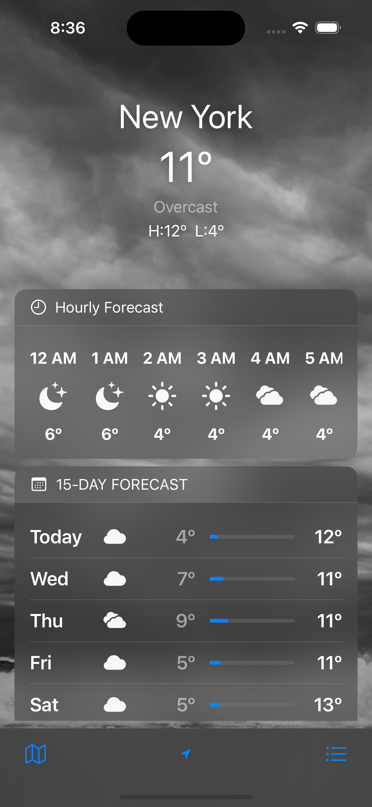

# IOS-native weather app clone

This is a simple application clone from a native iOS weather app for learning purposes.

## Installation
If you want to fetch the weather data from API, you'll need an API key from 
[VisualCrossing](https://www.visualcrossing.com/).  
 Once you get a key:  

1. Go to the `NetworkManager` file 
2. Replace `let API_KEY = "api_key"` by your key
   
 Weather requires Xcode 15.0 and iOS 16.0.

## Screenshots

  
   

## Demo
https://github.com/Johnny-1211/IOS-WeatherApp/assets/71998280/9545aab0-1b72-4361-ba39-3e643c53395d

## Built With

- [Swift](https://developer.apple.com/swift/) - Programming language used
- [Swift UI](https://developer.apple.com/documentation/swiftui/) - Creating user interfaces
- [UIKit](https://developer.apple.com/documentation/uikit) - For API fetching
- [MapKit](https://developer.apple.com/documentation/mapkit/) - Search for places and display results
- [CoreLocation](https://developer.apple.com/documentation/corelocation) - For getting device location and coordinating of searching place
- [SpriteKit](https://developer.apple.com/documentation/spritekit/) - For showing the rain effect and snow effect

## Architecture

The project follows the MVVM (Model-View-ViewModel) architecture pattern. It separates the user interface from the business logic and backend data, making the codebase more modular, testable, and maintainable.

## Issue
- The home page list of weather data didn't have a live update
- There are some places unable to search.
## License
This project is licensed under the [MIT](https://choosealicense.com/licenses/mit/)

